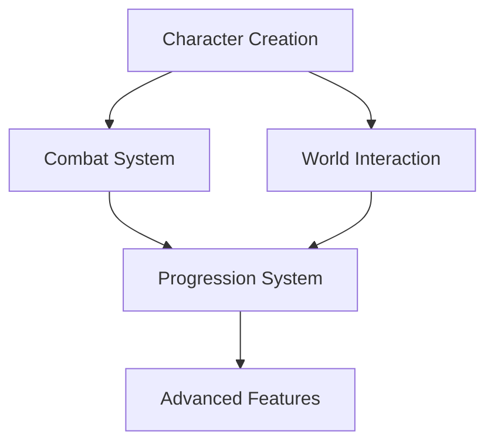

# 🔧 GAME SYSTEMS - Core Gameplay Mechanics

## 📁 **DIRECTORY OVERVIEW**

### **⚔️ COMBAT SYSTEMS**
Located in `combat/`

- **[COMBAT_ENHANCED_INDEX.md](combat/COMBAT_ENHANCED_INDEX.md)** - 🏆 **START HERE** - Complete combat overview
- **[COMBAT_SYSTEM.md](combat/COMBAT_SYSTEM.md)** - Core combat mechanics foundation
- **[COMBAT_POSITIONING.md](combat/COMBAT_POSITIONING.md)** - Tactical positioning and movement
- **[COMBAT_ACTION_ECONOMY.md](combat/COMBAT_ACTION_ECONOMY.md)** - Action points and timing system
- **[COMBAT_STATUS_EFFECTS.md](combat/COMBAT_STATUS_EFFECTS.md)** - Buffs, debuffs, and conditions
- **[COMBAT_WEAPON_PROPERTIES.md](combat/COMBAT_WEAPON_PROPERTIES.md)** - Weapon types and special properties
- **[DAMAGE_DEFENSE.md](combat/DAMAGE_DEFENSE.md)** - Damage calculation and defense mechanics

### **👤 CHARACTER SYSTEMS**
Located in `character/`

- **[CHARACTER_CREATION.md](character/CHARACTER_CREATION.md)** - Character creation with religious factions
- **[GAME_MECHANICS.md](character/GAME_MECHANICS.md)** - Core progression and attribute systems

### **🌍 WORLD INTERACTION**
Located in `world_interaction/`

- **[NPC_INTERACTION.md](world_interaction/NPC_INTERACTION.md)** - Dialogue, relationships, and social mechanics
- **[QUEST_SYSTEM.md](world_interaction/QUEST_SYSTEM.md)** - Quest types, progression, and rewards
- **[TRAVEL_SYSTEM.md](world_interaction/TRAVEL_SYSTEM.md)** - Movement, exploration, and fast travel

---

## 🚀 **IMPLEMENTATION STATUS (Settembre 2025)**

### ✅ **DESIGN COMPLETED**
- **Combat System**: 8 moduli completi con formule matematiche bilanciate
- **Character System**: Creazione complessa + progressione + fazioni religiose  
- **World Interaction**: NPC, quest e travel system completamente progettati
- **Integration Points**: Tutti i sistemi interconnessi e dependency mapping completo

### 🔄 **READY FOR CODING**
Tutti i sistemi sono **pronti per implementazione** con:
- Specifiche dettagliate per ogni meccanica
- Formule matematiche testate e bilanciate  
- Database schema definiti per persistenza
- API endpoint progettati per client-server communication

---

## 🎯 **PRIORITÀ IMPLEMENTAZIONE (Aggiornata)**

### **🥇 WEEK 1-2: Character Foundation** 
- Character creation API + database tables
- Stats calculation engine (Power formula + HP/MP)
- Talent system + class progression logic
- Basic inventory + equipment slot validation

### **🥈 WEEK 3-4: Combat Engine**
- D50 combat resolver + damage formulas
- Initiative system + turn-based mechanics  
- Status effects framework + buff/debuff logic
- Positioning system per tactical combat

### **🥉 WEEK 5-6: World Integration**
- Location system + movement between areas
- NPC interaction engine + dialogue trees
- Quest system + objective tracking
- Basic economy + merchant interactions

---

## 🔗 **SYSTEM DEPENDENCIES**

**Implementazione sequenziale**: Character → Combat → World → Advanced MMO features

---

**� Status**: Design 100% → Implementation Ready 🚀  
**⏱️ Tempo stimato**: 6-8 settimane per implementazione completa  
**🔧 Tech Stack**: TypeScript + Prisma + React (configurato e ready)
